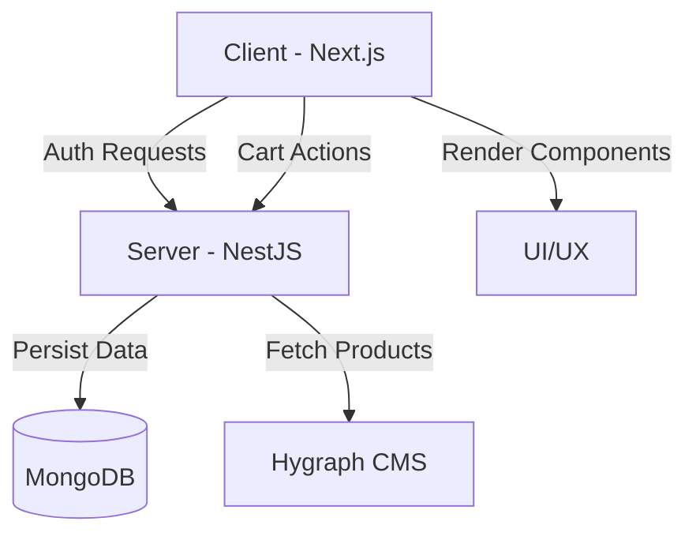

# 👟 Premium Sneaker Store


A premium, full-stack e-commerce platform designed for sneaker enthusiasts. Shopco provides a seamless shopping experience with real-time product updates, secure authentication, and a modern, responsive interface.

---

## 🌟 Key Features

-   **🚀 Seamless Authentication:** Secure JWT-based authentication for user accounts, ensuring private access to carts and profiles.
-   **🛒 Dynamic Shopping Cart:** A robust cart system powered by Redux Toolkit for instant UI updates and backend synchronization.
-   **👟 Product Discovery:** High-performance product listing and detail pages with data powered by Hygraph CMS.
-   **📱 Responsive Design:** Fully optimized for all screen sizes using a combination of Tailwind CSS 4 and Material UI components.
-   **🖼️ Rich Media:** High-quality image galleries and carousels for showcasing premium footwear.
-   **⚡ Fast Performance:** Server-side rendering and optimized data fetching with Next.js App Router.
-   **🛡️ Secure API:** A production-ready NestJS backend with structured error handling, validation, and security middleware.

---

## 🛠️ Tech Stack

### Frontend
-   **Framework:** Next.js 16 (App Router)
-   **State Management:** Redux Toolkit
-   **UI Components:** Material UI (MUI) & Emotion
-   **Styling:** Tailwind CSS 4.0
-   **Forms:** React Hook Form & Yup/Zod
-   **Icons:** Lucide React & MUI Icons
-   **Slider:** Swiper.js

### Backend
-   **Framework:** NestJS (v11)
-   **Database:** MongoDB with Mongoose ODM
-   **Authentication:** Passport.js & JWT
-   **CMS Integration:** Hygraph (Headless CMS)
-   **Validation:** Joi
-   **API Client:** Axios

---

## 🔄 Project Flow



---

## 📂 Project Structure

```bash
🏗️ Root
.
├── client/              # Next.js Frontend App
├── server/              # NestJS Backend Service
└── README.md            # Documentation
```

### 📂 Backend (`server/src`)
-   **auth/**: Authentication logic, strategies (JWT), and controllers.
-   **users/**: User management and schema definitions.
-   **products/**: Product API routes and logic.
-   **cart/**: Shopping cart management and persistence.
-   **hygraph/**: Integration layer for Hygraph CMS data fetching.
-   **database/**: MongoDB connection and Mongoose configuration.

### 📂 Frontend (`client/app`)
-   **app/**: Next.js App Router (Pages & Layouts).
-   **components/**: 
    -   **home/**: Sections like Hero, Promotions, and Product listings.
    -   **layout/**: Shared components (Navbar, Footer, Branding Bar).
-   **redux/**: Global state management (Slices & Store).
-   **services/**: API interaction layers using Axios.
-   **lib/**: Utility functions and helper classes.

---

## 🚀 Getting Started

### Prerequisites
-   Node.js (v18 or later)
-   npm or pnpm
-   MongoDB instance (Local or Atlas)
-   Hygraph Project (for CMS content)

### 1. Installation
Clone the repository and install dependencies in both folders:

```bash
# Clone the repo
git clone https://github.com/maaliksaad/sneaker-store.git
cd sneaker-store

# Install Client dependencies
cd client
npm install

# Install Server dependencies
cd ../server
npm install
```

### 2. Backend Setup
Create a `.env` file in the `server` directory:

```env
PORT=4000
MONGO_URI=your_mongodb_connection_string
JWT_SECRET=your_jwt_secret_key
JWT_EXPIRES=7d
HYGRAPH_ENDPOINT=your_hygraph_api_endpoint
HYGRAPH_TOKEN=your_hygraph_permanent_auth_token
```

Start the backend:
```bash
npm run start:dev
```

### 3. Frontend Setup
Create a `.env` file in the `client` directory:

```env
NEXT_PUBLIC_API_URL=http://localhost:4000
```

Start the frontend:
```bash
npm run dev
```

---

## 🛡️ License
This project is licensed under the UNLICENSED License - see the `package.json` for details.

Created with ❤️ by [Saad](https://github.com/maaliksaad)
